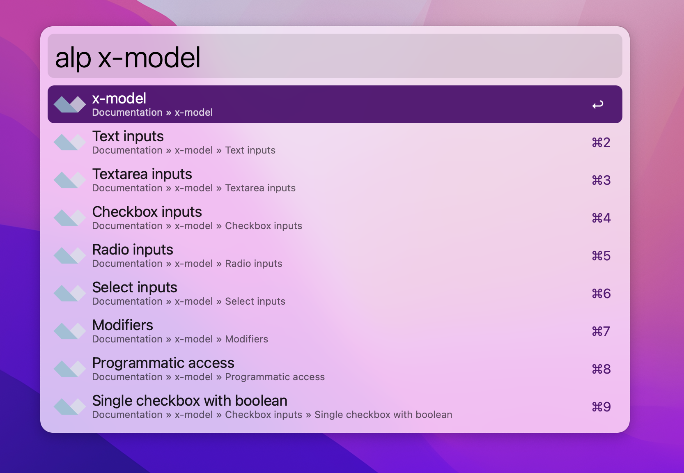

# Alpine.js docs search workflow for Alfred

An Alpine.js docs search workflow for [Alfred](https://www.alfredapp.com).




## Installation

1. [Download the latest version](https://github.com/Fadarrizz/alfred-alpinejs-docs/releases/download/v0.1.0/alpinejs-docs.alfredworkflow)
2. Install the workflow by double-clicking the `.alfredworkflow` file
3. You can add the workflow to a category, then click "Import" to finish importing. You'll now see the workflow listed in the left sidebar of your Workflows preferences pane.


## Usage

Just type `alp` followed by your search query:

```
alp <query>
alp x-model
```

Either press `⌘Y` to Quick Look the result, or press `<enter>` to open it in your web browser.


## Credits

This workflow is based on Till Kruss' [Laravel Docs workflow](https://github.com/tillkruss/alfred-laravel-docs).
